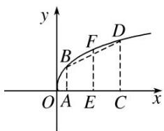

> [!faq]- 《专题11 幂函数-函数》例题解析
>
> > [!success]- **【答案】** A
>
> > [!note]- **【分析】**
> > 本题未单列分析。
>
> > [!note]- **【解析】**
> > 答案 A 解析 幂函数 $f(x)=x^{\frac{4}{5}}$ 在 $(0, +\infty)$ 是增函数，大致图象如图所示.
> >
> > 
> >
> > 设 $A(x_{1},0)$ ， $C(x_{2},0)$ ，其中 $0 < x_{1} < x_{2}$ ，则 $AC$ 的中点 $E$ 的坐标为 $\left[\frac{x_1 + x_2}{2}, 0\right]$ ， $|AB| = f(x_1)$ ， $|CD| = f(x_2)$ ， $|EF|$
> >
> > $= f\left(\frac{x_1 + x_2}{2}\right). \because |EF| > \frac{1}{2} (|AB| + |CD|), \therefore f\left(\frac{x_1 + x_2}{2}\right) > \frac{f(x_1) + f(x_2)}{2},$ 故选A.
> >
> > ## 【对点训练】
