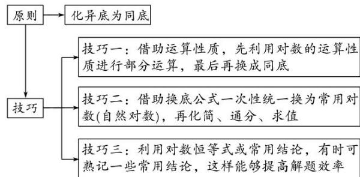

## 考点二 对数式的运算

## 考点二 对数式的运算

## 【知识梳理】

## 1. 对数的概念

(1)对数的定义

如果 $a^x = N(a > 0$ ，且 $a \neq 1)$ ，那么数 $x$ 叫做以 $a$ 为底 $N$ 的对数，记作 $x = \log_a N$ ，其中 $a$ 叫做对数的底数， $N$ 叫做真数.

(2)几种常见对数

<table><tr><td>对数形式</td><td>特点</td><td>记法</td></tr><tr><td>一般对数</td><td>底数为a(a&gt;0,且a≠1)</td><td> $\log_a N$ </td></tr><tr><td>常用对数</td><td>底数为10</td><td> $\lg N$ </td></tr><tr><td>自然对数</td><td>底数为e</td><td> $\ln N$ </td></tr></table>

## 2. 对数恒等式

$a^{\log_a N} = N (a > 0$ 且 $a \neq 1, N > 0$ ).

## 3. 对数的性质

(1)1 的对数是零，即 $\log_{a}1=0(a>0$ 且 $a\neq1)$ ;

(2)底数的对数等于1，即 $\log_a a = 1 (a > 0$ 且 $a \neq 1)$ ;

(3)负数和零没有对数.

4. 对数的运算法则

如果 a>0，且 $a\neq1$ ，M>0，N>0，那么

$$
① \log_ {a} (M N) = \log_ {a} M + \log_ {a} N; \quad ② \log_ {a} \frac {M}{N} = \log_ {a} M - \log_ {a} N; \quad ③ \log_ {a} M ^ {n} = n \log_ {a} M (n \in \mathbf {R});
$$

5. 对数的换底公式及推广

换底公式： $\log_bN = \frac{\log_aN}{\log_ab} (a,b$ 均大于零，且不等于1);

推广：(1) $\log_{a}b\cdot\log_{b}a=1$ ，即 $\log_{a}b=\frac{1}{\log_{b}a}(a,\ b$ 均大于0且不等于1);

(2) $\log_{a}^{m}b^{n}=\frac{n}{m}\log_{a}b(a,\ b\text{均大于0且不等于1，}m\neq0,\ n\in\mathbf{R});$

## 【方法总结】

## 对数运算问题的基本原则和方法

(1)基本原则：对数的化简求值一般是正用或逆用公式，对真数进行处理，选哪种策略化简，取决于问题的实际情况，一般本着便于真数化简的原则进行.

(2)两种常用的方法: ① “收”, 将同底的两对数的和(差)收成积(商)的对数;

② “拆”，将积(商)的对数拆成同底的两对数的和(差).

(3)利用换底公式进行化简求值的原则和技巧

![[高中/总复习/专题/函数/专题12 指数式、对数式的运算-函数/专题十二_指数式对数式的运算/考点二_对数式的运算/例题选讲/例题选讲.md]]
![[高中/总复习/专题/函数/专题12 指数式、对数式的运算-函数/专题十二_指数式对数式的运算/考点二_对数式的运算/对点训练/对点训练.md]]
