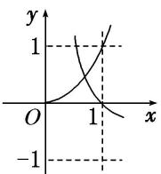
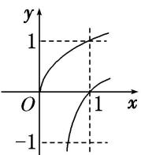

<!-- question-source:start -->
(4) 在同一直角坐标系中，函数 $f(x) = x^{a}(x \geq 0)$ ， $g(x) = \log_{a} x (a > 0 \text{ 且 } a \neq 1)$ 的图象可能是（）

A

B

C

D
<!-- question-source:end -->

![[高中/总复习/专题/函数/专题13 对数函数-函数/考点01_对数函数图象辨析/例题/answers/Q00044451A1.md]]
