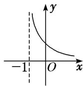
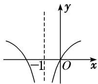
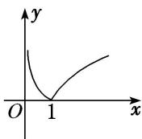
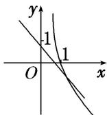
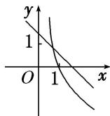
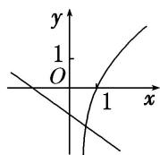
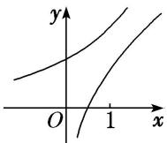
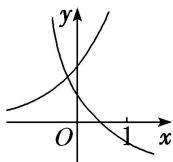

> [!faq]- 《专题13 对数函数-函数》例题解析
>
> > [!success]- **【答案】** D
>
> > [!note]- **【分析】**
> > 本题未单列分析。
>
> > [!note]- **【解析】**
> > 答案 A 解析 因为 $y=\lg|x-1|=\left\{\begin{aligned}\lg(x-1),&x>1,\\ \lg(1-x),&x<1.\end{aligned}\right.$ 当 x=1 时，函数无意义，故排除 B、D。又当 x=2 或 0 时，y=0，所以 A 项符合题意。
> > (2) 函数 $f(x)=|\log_{a}(x+1)|(a>0, \text{且 } a\neq1)$ 的大致图象是()
> > 
> > A
> > 
> > B
> > 
> > C
> > 
> > D
> > 答案 C 解析 函数 $f(x)=|\log_{a}(x+1)|$ 的定义域为 $\{x|x>-1\}$ ，且对任意的 x，均有 $f(x)\geq0$ ，结合对数函数的图象可知选 C.
> > (3) 函数 $y=\log_{a}x$ 与 $y=-x+a$ 在同一坐标系中的图象可能是()
> > 
> > A
> > 
> > B
> > 
> > C
> > 
> > D
> > 答案 A 解析 当 a>1 时，函数 $y=\log_{a}x$ 的图象为选项 B、D 中过点(1,0)的曲线，此时函数 $y=-x+a$ 的图象与 y 轴的交点的纵坐标 a 应满足 a>1，选项 B、D 中的图象都不符合要求；当 0<a<1 时，函数 $y=\log_{a}x$ 的图象为选项 A、C 中过点(1,0)的曲线，此时函数 $y=-x+a$ 的图象与 y 轴的交点的纵坐标 a 应满足 0<a<1，选项 A 中的图象符合要求，选项 C 中的图象不符合要求.
> > (4) 在同一直角坐标系中，函数 $f(x) = x^{a}(x \geq 0)$ ， $g(x) = \log_{a} x (a > 0 \text{ 且 } a \neq 1)$ 的图象可能是（）
> > 
> > A
> > 
> > B
> > 
> > 
> > C
> > D
> > 答案 D 解析 当 a>1 时，函数 $f(x)=x^{a}(x\geq0)$ 单调递增，函数 $g(x)=\log_{a}x$ 单调递增，且过点 $(1,0)$ ，由幂函数的图象性质可知 C 错；当 0<a<1 时，函数 $f(x)=x^{a}(x\geq0)$ 单调递增，且过点 $(1,1)$ ，函数 $g(x)=\log_{a}x$ 单调递减，且过点 $(1,0)$ ，排除 A，又由幂函数的图象性质可知 B 错．故选 D.
> > (5) (2019·浙江) 在同一直角坐标系中，函数 $y = \frac{1}{a^x}$ ， $y = \log_a\left(\frac{x + \frac{1}{2}}{2}\right) (a > 0$ ，且 $a \neq 1$ ) 的图象可能是（）
> > 
> > A
> > 
> > B
> > 
> > C
> > 
> > D
> > 答案 D 解析 对于函数 $y=\log_{a}\left(x+\frac{1}{2}\right)$ ，当 y=0 时，有 $x+\frac{1}{2}=1$ ，得 $x=\frac{1}{2}$ ，即 $y=\log_{a}\left(x+\frac{1}{2}\right)$ 的图象恒过定点 $\left(\frac{1}{2},0\right)$ ，排除选项 A、C；函数 $y=\frac{1}{a^{x}}$ 与 $y=\log_{a}\left(x+\frac{1}{2}\right)$ 在各自定义域上单调性相反，排除选项 B，故选 D.
> > 【对点训练】
