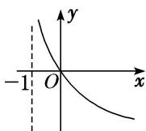
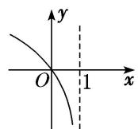
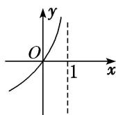

<!-- question-source:start -->
1. 函数 $f(x) = 2\log_4(1 - x)$ ，则函数 $f(x)$ 的大致图象是（）

A

B

C

D
<!-- question-source:end -->

![[高中/总复习/专题/函数/专题13 对数函数-函数/考点01_对数函数图象辨析/对点训练/answers/Q00041112A1.md]]
