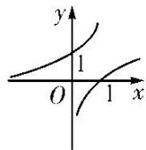
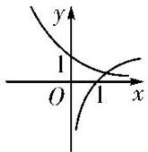

<!-- question-source:start -->
4. 已知 $\lg a + \lg b = 0 (a > 0$ ，且 $a \neq 1, b > 0$ ，且 $b \neq 1)$ ，则函数 $f(x) = a^x$ 与 $g(x) = -\log_b x$ 的图象可能是（）

A

B

C

D
<!-- question-source:end -->

![[高中/总复习/专题/函数/专题13 对数函数-函数/考点01_对数函数图象辨析/对点训练/answers/Q00041115A1.md]]
