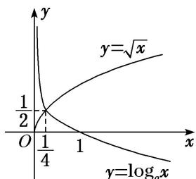

> [!faq]- 《专题13 对数函数-函数》例题解析
>
> > [!success]- **【答案】** B
>
> > [!note]- **【分析】**
> > 本题未单列分析。
>
> > [!note]- **【解析】**
> > 答案 $\left(\frac{1}{16}, 1\right)$ 解析 若 $\sqrt{x} < \log_{a}x$ 在 $x \in \left[0, \frac{1}{4}\right]$ 时成立，则 0 < a < 1，且 $y = \sqrt{x}$ 的图象在 $y = \log_{a}x$ 图象的下方，作出图象如图所示。由图象知 $\sqrt{\frac{1}{4}} < \log_{a}\frac{1}{4}$ ，所以 $\left\{\begin{aligned}&0 < a < 1,\\ &a > \frac{1}{4},\end{aligned}\right.$ 解得 $\frac{1}{16} < a < 1$ 。即实数 a 的取值范围是 $\left(\frac{1}{16}, 1\right)$ 。
> > 
> > (2) 当 $0 < x \leq \frac{1}{2}$ 时， $4^x < \log_a x$ ，则 $a$ 的取值范围是（）
> > A. $\left(0, \frac{\sqrt{2}}{2}\right)$ B. $\left(\frac{\sqrt{2}}{2}, 1\right)$ C. $(1, \sqrt{2})$ D. $(\sqrt{2}, 2)$
> > 答案 B 解析 易知 $0 < a < 1$ ，函数 $y = 4^x$ 与 $y = \log_a x$ 的大致图象如图，则由题意可知只需满足 $\log_a \frac{1}{2} > 4\frac{1}{2}$ ，解得 $a > \frac{\sqrt{2}}{2}$ ， $\therefore \frac{\sqrt{2}}{2} < a < 1$ ，故选 B.
> > 
> > (3) 设方程 $10^{x} = |\lg (-x)|$ 的两个根分别为 $x_{1}, x_{2}$ ，则（ ）A. $x_{1}x_{2} < 0$ B. $x_{1}x_{2} = 0$ C. $x_{1}x_{2} > 1$ D. $0 < x_{1}x_{2} < 1$
> > 答案 D 解析 作出 $y = 10^{x}$ 与 $y = |\lg(-x)|$ 的大致图象，如图．显然 $x_{1} < 0, x_{2} < 0$ ．不妨令 $x_{1} < x_{2}$ ，则 $x_{1} < -1 < x_{2} < 0$ ，所以 $10^{x_{1}} = \lg(-x_{1})$ ， $10^{x_{2}} = -\lg(-x_{2})$ ，此时 $10^{x_{1}} < 10^{x_{2}}$ ，即 $\lg(-x_{1}) < -\lg(-x_{2})$ ，由此得 $\lg(x_{1}x_{2}) < 0$ ，所以 $0 < x_{1}x_{2} < 1$ ，故选 D.
> > 
> > (4) 已知函数 $f(x) = \begin{cases} \log_2 x, & x > 0, \\ 3^x, & x \leq 0, \end{cases}$ 关于 $x$ 的方程 $f(x) + x - a = 0$ 有且只有一个实根，则实数 $a$ 的取值范围是 \_\_\_\_.
> > 答案 $a > 1$ 解析 问题等价于函数 $y = f(x)$ 与 $y = -x + a$ 的图象有且只有一个交点，结合函数图象可知 $a > 1$ .
> > 
> > (5)(2018·全国III)下列函数中，其图象与函数 $y = \ln x$ 的图象关于直线 $x = 1$ 对称的是( ) A. $y = \ln (1 - x)$ B. $y = \ln (2 - x)$ C. $y = \ln (1 + x)$ D. $y = \ln (2 + x)$
> > 答案 B 解析 易知 $y=\ln x$ 与 $y=\ln(-x)$ 的图象关于 y 轴对称．而 $y=\ln(2-x)=\ln[-(x-2)]$ ，由此可知 $y=\ln(2-x)$ 的图象只需将 $y=\ln(-x)$ 的图象向右平移 2 个单位即可得到．因此 $y=\ln x$ 与 $y=\ln(2-x)$ 的图象关于直线 x=1 对称.
> > ## 【对点训练】
