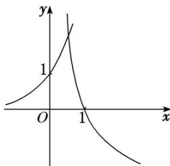

> [!faq]- 《专题13 对数函数-函数》例题解析
>
> > [!success]- **【答案】** B
>
> > [!note]- **【解析】**
> > 答案 B 解析 易知 $0 < a < 1$ ，函数 $y = 4^x$ 与 $y = \log_a x$ 的大致图象如图，则由题意可知只需满足 $\log_a \frac{1}{2} > 4\frac{1}{2}$ ，解得 $a > \frac{\sqrt{2}}{2}$ ， $\therefore \frac{\sqrt{2}}{2} < a < 1$ ，故选 B.
> >
> > 
