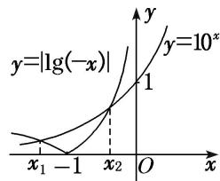

> [!faq]- 《专题13 对数函数-函数》例题解析
>
> > [!success]- **【答案】** D
>
> > [!note]- **【分析】**
> > 本题未单列分析。
>
> > [!note]- **【解析】**
> > 答案 D 解析 作出 $y = 10^{x}$ 与 $y = |\lg(-x)|$ 的大致图象，如图．显然 $x_{1} < 0, x_{2} < 0$ ．不妨令 $x_{1} < x_{2}$ ，则 $x_{1} < -1 < x_{2} < 0$ ，所以 $10^{x_{1}} = \lg(-x_{1})$ ， $10^{x_{2}} = -\lg(-x_{2})$ ，此时 $10^{x_{1}} < 10^{x_{2}}$ ，即 $\lg(-x_{1}) < -\lg(-x_{2})$ ，由此得 $\lg(x_{1}x_{2}) < 0$ ，所以 $0 < x_{1}x_{2} < 1$ ，故选 D.
> >
> > 
