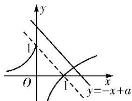

> [!faq]- 《专题13 对数函数-函数》例题解析
>
> > [!success]- **【答案】** 详见解析
>
> > [!note]- **【分析】**
> > 本题未单列分析。
>
> > [!note]- **【解析】**
> > 答案 $a > 1$ 解析 问题等价于函数 $y = f(x)$ 与 $y = -x + a$ 的图象有且只有一个交点，结合函数图象可知 $a > 1$ .
> >
> > 
