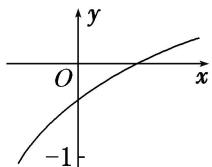

<!-- question-source:start -->
7. 已知函数 $f(x) = \log_a 2^x + b - 1 (a > 0, a \neq 1)$ 的图象如图所示，则 $a, b$ 满足的关系是（）

A. $0 < a^{-1} < b < 1$ B. $0 < b < a^{-1} < 1$ C. $0 < b^{-1} < a < 1$ D. $0 < a^{-1} < b^{-1} < 1$
<!-- question-source:end -->

![[高中/总复习/专题/函数/专题13 对数函数-函数/考点02_对数函数图象的应用/对点训练/answers/Q00041119A1.md]]
