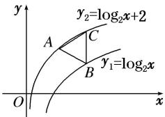

<!-- question-source:start -->
12. 设平行于 $y$ 轴的直线分别与函数 $y_{1} = \log_{2}x$ 及函数 $y_{2} = \log_{2}x + 2$ 的图象交于 $B, C$ 两点，点 $A(m, n)$ 位于函数 $y_{2} = \log_{2}x + 2$ 的图象上，如图，若 $\triangle ABC$ 为正三角形，则 $m \cdot 2^{n} =$ \_\_\_\_.

<!-- question-source:end -->

![[高中/总复习/专题/函数/专题13 对数函数-函数/考点02_对数函数图象的应用/对点训练/answers/Q00041124A1.md]]
