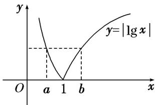

> [!faq]- 《专题13 对数函数-函数》例题解析
>
> > [!success]- **【答案】** C
>
> > [!note]- **【解析】**
> > 答案 C 解析 $f(x) = |\lg x|$ 的图象如图所示，由题知 $f(a) = f(b)$ ，则有 $0 < a < 1 < b$ ， $\therefore f(a) = |\lg a| = -\lg a$ ， $f(b) = |\lg b| = \lg b$ ，即 $-\lg a = \lg b$ ，则 $a = \frac{1}{b}$ ， $\therefore a + 2b = 2b + \frac{1}{b}$ . 令 $g(b) = 2b + \frac{1}{b}$ ， $g'(b) = 2 - \frac{1}{b^2}$ ，显然当 $b \in (1, +\infty)$ 时， $g'(b) > 0$ ， $\therefore g(b)$ 在 $(1, +\infty)$ 上为增函数， $\therefore g(b) = 2b + \frac{1}{b} > 3$ ，故选 C.
> >
> > 
