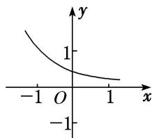

<!-- question-source:start -->
(3) 函数 $f(x)=a^{x^{-b}}$ 的图象如图所示，其中 a, b 为常数，则下列结论正确的是()

A. $a > 1, b <   0$ B. $a > 1,b > 0$ C. $0 <   a <   1,b > 0$ D. $0 <   a <   1,b <   0$
<!-- question-source:end -->

![[高中/总复习/专题/函数/专题13 指数函数-函数/考点01_指数函数的图象及应用/例题/answers/Q00044479A1.md]]
