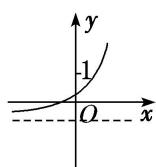
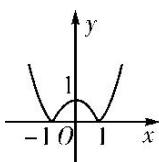
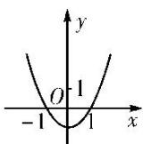

> [!faq]- 《专题13 指数函数-函数》例题解析
>
> > [!success]- **【答案】** B
>
> > [!note]- **【分析】**
> > 本题未单列分析。
>
> > [!note]- **【解析】**
> > 答案 A 解析 函数 $f(x)=2^{1-x}=2\times\left(\frac{1}{2}\right)x$ ，单调递减且过点(0,2)，选项 A 中的图象符合要求.
> > 答案 A 解析 函数 $f(x)=2^{1-x}=2\times\sqrt{2}x$ ，单调递减且过点(0,2)，选项 A 中的图象符合要求.
> > (2) 函数 $f(x)=1-e^{|x|}$ 的图象大致是()
> > 
> > A
> > 
> > B
> > 
> > C
> > 
> > D
> > 答案 A 解析 因为函数 $f(x)=1-\mathrm{e}^{|x|}$ 是偶函数，且值域是 $(-∞,0]$ ，只有 A 满足上述两个性质.
> > (3) 函数 $f(x)=a^{x^{-b}}$ 的图象如图所示，其中 a, b 为常数，则下列结论正确的是()
> > 
> > A. $a > 1, b <   0$ B. $a > 1,b > 0$ C. $0 <   a <   1,b > 0$ D. $0 <   a <   1,b <   0$
> > 答案 D 解析 由 $f(x)=a^{x-b}$ 的图象可以观察出函数 $f(x)=a^{x-b}$ 在定义域上单调递减，所以 0<a<1，函数 $f(x)=a^{x-b}$ 的图象是在 $y=a^{x}$ 的图象的基础上向左平移得到的，所以 b<0.
> > (4) 已知函数 $f(x)=(x-a)(x-b)$ (其中 a>b) 的图象如图所示，则函数 $g(x)=a^{x}+b$ 的图象是()
> > 
> > 
> > A
> > 
> > B
> > 
> > C
> > 
> > D
> > 答案 C 解析 由函数 $f(x)$ 的图象可知， $-1 < b < 0$ ， $a > 1$ ，则 $g(x) = a^x + b$ 为增函数，当 $x = 0$ 时， $g(0) = 1 + b > 0$ ，故选 C.
> > (5) 已知函数 $f(x)=2^{x}-2$ ，则函数 $y=|f(x)|$ 的图象可能是()
> > 
> > 
> > A
> > B
> > 
> > 
> > C
> > D
> > 答案 B 解析 $|f(x)|=|2^{x}-2|=\begin{cases}2^{x}-2,&x\geq1,\\2-2^{x},&x<1,\end{cases}$ 易知函数 $y=|f(x)|$ 的图象的分段点是 x=1，且过点 (1,
> > 0), (0, 1), $\left(-1, \frac{3}{2}\right)$ . 又 $|f(x)| \geq 0$ ，所以 B 项正确．故选 B.
> > ## 考向2 指数函数图象的应用
> > ## 【方法总结】
> > 一些指数方程、不等式问题的求解，往往利用相应的指数型函数图象数形结合求解.
