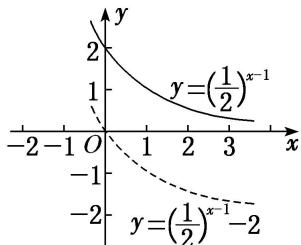
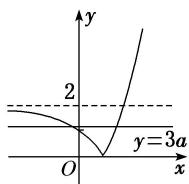
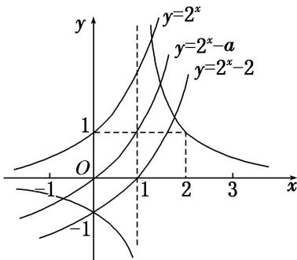

> [!faq]- 《专题13 指数函数-函数》例题解析
>
> > [!success]- **【答案】** B
>
> > [!note]- **【分析】**
> > 本题未单列分析。
>
> > [!note]- **【解析】**
> > 答案 $(- \infty, 0]$ 解析 函数 $y = |3^x - 1|$ 的图象是由函数 $y = 3^x$ 的图象向下平移一个单位后，再把位于 $x$ 轴下方的图象沿 $x$ 轴翻折到 $x$ 轴上方得到的，函数图象如图所示.
> > 
> > 由图象知，其在 $(-∞, 0]$ 上单调递减，所以k的取值范围为 $(-∞, 0]$ .
> > (2) 若函数 $y=2^{1-x}+m$ 的图象不经过第一象限，则 m 的取值范围为 \_\_\_\_.
> > 答案 $(- \infty, -2]$ 解析 $y = 2^{1 - x} + m = \left(\frac{1}{2}\right)^{x - 1} + m$ ，函数 $y = \left(\frac{1}{2}\right)^{x - 1}$ 的图象如图所示，则要使其图象不经过第一象限，则 $m \leq -2$ 。故 $m$ 的取值范围为 $(- \infty, -2]$ .
> > 
> > (3) 已知 $a > 0$ , 且 $a \neq 1$ , 若函数 $y = |a^x - 2|$ 与 $y = 3a$ 的图象有两个交点, 则实数 $a$ 的取值范围是 \_\_\_\_. 答案 $\left(0, \frac{2}{3}\right)$ 解析 ① 当 $0 < a < 1$ 时, 作出函数 $y = |a^x - 2|$ 的图象如图(1). 若直线 $y = 3a$ 与函数 $y = |a^x - 2| (0 < a < 1)$ 的图象有两个交点, 则由图象可知 $0 < 3a < 2$ , 所以 $0 < a < \frac{2}{3}$ .
> > 
> > 图(1)
> > 
> > 图(2)
> > - **②**：当 a>1 时，作出函数 $y=|a^{x}-2|$ 的图象如图(2)，若直线 y=3a 与函数 $y=|a^{x}-2|(a>1)$ 的图象有两个交点，则由图象可知 0<3a<2，此时无解．所以实数 a 的取值范围是 $\left(0, \frac{2}{3}\right)$ .
> > (4) 若存在负实数使得方程 $2^{x} - a = \frac{1}{x - 1}$ 成立，则实数 $a$ 的取值范围是（ ）A. $(2, +\infty)$ B. $(0, +\infty)$ C. $(0, 2)$ D. $(0, 1)$
> > 答案 C 解析 在同一坐标系内分别作出函数 $y = \frac{1}{x - 1}$ 和 $y = 2^x - a$ 的图象，则由图知，当 $a \in (0, 2)$ 时符合要求.
> > 
> > (5) 已知函数 $a$ ， $b$ 满足等式 $\left(\frac{1}{2}\right)^a = \left(\frac{1}{3}\right)^b$ ，下列五个关系式：① $0 < b < a$ ；
> > - **②**：$a < b < 0$ ；
> > - **③**：$0 < a < b$ ；
> > - **④**：$b < a < 0$ ；
> > - **⑤**：$a = b$ .
> > 其中不可能成立的关系式有( )
> > A. 1个    B. 2个    C. 3个    D. 4个
> > 答案 B 解析 函数 $y_{1}=\left(\frac{1}{2}\right)x$ 与 $y_{2}=\left(\frac{1}{3}\right)x$ 的图象如图所示.
> > 
> > 
> > 由 $\left(\frac{1}{2}\right)^a = \left(\frac{1}{3}\right)^b$ 得 $a < b < 0$ 或 $0 < b < a$ 或 $a = b = 0$ . 故①②⑤可能成立，③④不可能成立.
