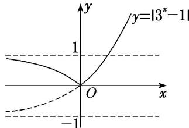

> [!faq]- 《专题13 指数函数-函数》例题解析
>
> > [!success]- **【答案】** 详见解析
>
> > [!note]- **【解析】**
> > 答案 $(- \infty, 0]$ 解析 函数 $y = |3^x - 1|$ 的图象是由函数 $y = 3^x$ 的图象向下平移一个单位后，再把位于 $x$ 轴下方的图象沿 $x$ 轴翻折到 $x$ 轴上方得到的，函数图象如图所示.
> >
> > 
> >
> > 由图象知，其在 $(-∞, 0]$ 上单调递减，所以k的取值范围为 $(-∞, 0]$ .
