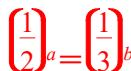

> [!faq]- 《专题13 指数函数-函数》例题解析
>
> > [!success]- **【答案】** B
>
> > [!note]- **【分析】**
> > 本题未单列分析。
>
> > [!note]- **【解析】**
> > 答案 B 解析 函数 $y_{1}=\left(\frac{1}{2}\right)x$ 与 $y_{2}=\left(\frac{1}{3}\right)x$ 的图象如图所示.
> > 
> > 
> > 由 $\left(\frac{1}{2}\right)^a = \left(\frac{1}{3}\right)^b$ 得 $a < b < 0$ 或 $0 < b < a$ 或 $a = b = 0$ . 故①②⑤可能成立，③④不可能成立.
