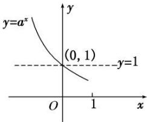

<!-- question-source:start -->
1. 指数函数的定义

函数 $y=a^{x}(a>0$ ，且 $a\neq1)$ 叫做指数函数，其中指数 x 是自变量，函数的定义域是 R，a 是底数.

## 2. 指数函数的图象

<table><tr><td rowspan="2">函数</td><td colspan="2"> $y = a^{x}(a > 0$ ,且  $a \neq 1)$ </td></tr><tr><td> $0 < a < 1$ </td><td> $a > 1$ </td></tr><tr><td>图象</td><td></td><td></td></tr><tr><td rowspan="2">图象特征</td><td colspan="2">在  $x$  轴上方,过定点(0,1)</td></tr><tr><td>当  $x$  逐渐增大时,图象逐渐下降</td><td>当  $x$  逐渐增大时,图象逐渐上升</td></tr></table>

## 【常用结论】

## 1. 指数函数图象的画法

画指数函数 $y = a^{x} (a > 0$ ，且 $a \neq 1$ 的图象，应抓住三个关键点： $(1, a), (0, 1)$ ， $\left(-1, \frac{1}{a}\right)$ 和一条渐近线 $y = 0$ .
<!-- question-source:end -->
