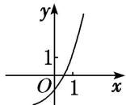
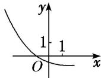

<!-- question-source:start -->
3. 函数 $y = a^{x} - a^{-1} (a > 0$ ，且 $a \neq 1$ 的图象可能是（）

A

B

C

D
<!-- question-source:end -->

![[高中/总复习/专题/函数/专题13 指数函数-函数/考点01_指数函数的图象及应用/对点训练/answers/Q00041150A1.md]]
