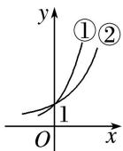
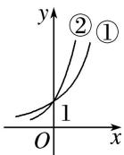
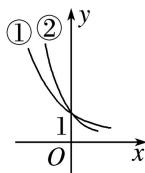

<!-- question-source:start -->
4. 已知 $0 < m < n < 1$ ，则指数函数① $y = m^x$ ，② $y = n^x$ 的图象为（）

A

B

C

D
<!-- question-source:end -->

![[高中/总复习/专题/函数/专题13 指数函数-函数/考点01_指数函数的图象及应用/对点训练/answers/Q00041151A1.md]]
