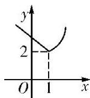
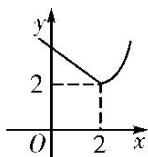
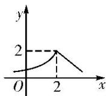

<!-- question-source:start -->
5. 定义一种运算: $a \otimes b = \begin{cases} a, & a \geq b, \\ b, & a < b, \end{cases}$ 已知函数 $f(x) = 2^x \otimes (3 - x)$ , 那么函数 $y = f(x + 1)$ 的大致图象是( )

Λ

B

C

D
<!-- question-source:end -->

![[高中/总复习/专题/函数/专题13 指数函数-函数/考点01_指数函数的图象及应用/对点训练/answers/Q00041152A1.md]]
