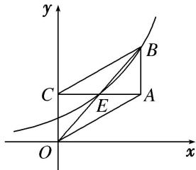

<!-- question-source:start -->
10. 如图, 在面积为 8 的平行四边形 $OABC$ 中, $AC \perp CO$ , $AC$ 与 $BO$ 交于点 $E$ . 若指数函数 $y = a^{x} (a > 0$ , 且 $a \neq 1)$ 经过点 $E$ , $B$ , 则 $a$ 的值为( )

A. $\sqrt{2}$ B. $\sqrt{3}$ C. 2 D. 3
<!-- question-source:end -->

![[高中/总复习/专题/函数/专题13 指数函数-函数/考点01_指数函数的图象及应用/对点训练/answers/Q00041157A1.md]]
