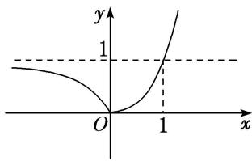

> [!faq]- 《专题13 指数函数-函数》例题解析
>
> > [!success]- **【答案】** D
>
> > [!note]- **【分析】**
> > 本题未单列分析。
>
> > [!note]- **【解析】**
> > 答案 D 解析 作出函数 $f(x) = |2^x - 1|$ 的图象如图所示，因为 $a < b < c$ ，且有 $f(a) > f(c) > f(b)$ ，所以必有 $a < 0$ ， $0 < c < 1$ ，且 $|2^a - 1| > |2^c - 1|$ ，所以 $1 - 2^a > 2^c - 1$ ，则 $2^a + 2^c < 2$ ，且 $2^a + 2^c > 1$ 。故选 D.
> > 
