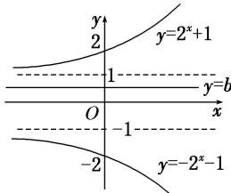

> [!faq]- 《专题13 指数函数-函数》例题解析
>
> > [!success]- **【答案】** 详见解析
>
> > [!note]- **【分析】**
> > 本题未单列分析。
>
> > [!note]- **【解析】**
> > 答案 $[-1, 1]$ 解析 曲线 $|y| = 2^x + 1$ 与直线 $y = b$ 的图象如图所示，由图可知：如果 $|y| = 2^x + 1$ 与直线 $y = b$ 没有公共点，则 $b$ 应满足的条件是 $b \in [-1, 1]$ .
> > 
