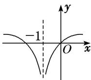
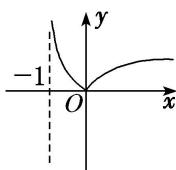
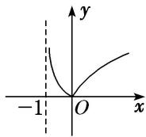
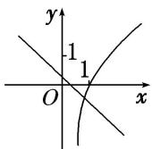
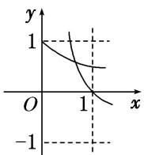
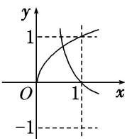
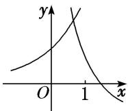
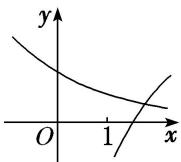

<!-- question-source:start -->
[例 1] (1) 函数 $y=\lg|x-1|$ 的图象是()

A

B

C

D

(2) 函数 $f(x)=|\log_{a}(x+1)|(a>0, \text{且 } a\neq1)$ 的大致图象是()

A

B

C

D

(3) 函数 $y=\log_{a}x$ 与 $y=-x+a$ 在同一坐标系中的图象可能是()

A

B

C

D

(4) 在同一直角坐标系中，函数 $f(x) = x^{a}(x \geq 0)$ ， $g(x) = \log_{a} x (a > 0 \text{ 且 } a \neq 1)$ 的图象可能是（）

A

B

C

D

(5) (2019·浙江) 在同一直角坐标系中，函数 $y = \frac{1}{a^x}$ ， $y = \log_a\left(\frac{x + \frac{1}{2}}{2}\right) (a > 0$ ，且 $a \neq 1$ ) 的图象可能是（）

A

B

C

D
<!-- question-source:end -->

![[高中/总复习/专题/函数/专题13 指数函数与对数函数-函数/专题十三_对数函数/考点一_对数函数图象辨析/例题选讲/例题/answers/Q00030213A1.md]]
