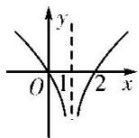
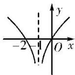
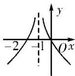

<!-- question-source:start -->
3. 函数 $f(x) = \lg \frac{1}{|x + 1|}$ 的大致图象是( )

A

B

C

D
<!-- question-source:end -->

![[高中/总复习/专题/函数/专题13 指数函数与对数函数-函数/专题十三_对数函数/考点一_对数函数图象辨析/对点训练/题目/answers/Q00030216A1.md]]
