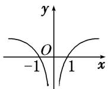
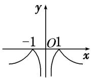

<!-- question-source:start -->
5. 若函数 $y = a^{|x|} (a > 0$ ，且 $a \neq 1$ 的值域为 $\{y | y \geq 1\}$ ，则函数 $y = \log_a |x|$ 的图象大致是（）

A

B

C

D
<!-- question-source:end -->

![[高中/总复习/专题/函数/专题13 指数函数与对数函数-函数/专题十三_对数函数/考点一_对数函数图象辨析/对点训练/题目/answers/Q00030218A1.md]]
