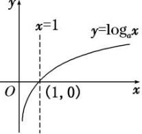
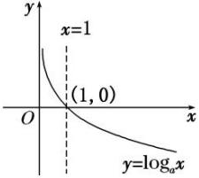
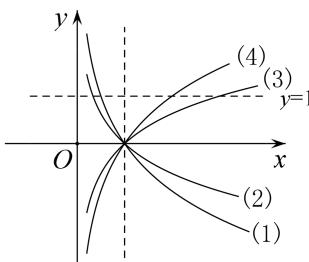

## 考点一 对数函数图象辨析

## 考点一 对数函数图象辨析

## 【基本知识】

## 1. 对数函数的概念

函数 $y=\log_{a}x(a>0$ ，且 $a\neq1)$ 叫做对数函数，其中 x 是自变量，函数的定义域是 $(0,+\infty)$ .

## 2. 对数函数的图象

<table><tr><td>函数</td><td> $y=\log_{a}x, a>1$ </td><td>\( y=\log_{a}x, 0</td></tr><tr><td>图象</td><td>- </td><td></td></tr><tr><td rowspan="2">图象特征</td><td colspan="2">在y轴右侧,过定点(1,0)</td></tr><tr><td>当x逐渐增大时,图象是上升的</td><td>当x逐渐增大时,图象是下降的</td></tr></table>

## 3. 指数函数与对数函数的关系

指数函数 $y=a^{x}(a>0$ ，且 $a\neq1)$ 与对数函数 $y=\log_{a}x(a>0$ ，且 $a\neq1)$ 互为反函数，它们的图象关于直线 y=x 对称.

## 【常用结论】

## (1)对数函数图象的画法

画对数函数 $y = \log_a x (a > 0$ ，且 $a \neq 1)$ 的图象，应抓住三个关键点：(1, 0)，(a, 1)， $\begin{bmatrix} 1, & -1 \\ a & \end{bmatrix}$ 和一条渐近线 $x = 0$ .

(2)底数 a 与 1 的大小关系决定了对数函数图象的“升降”: 当 a>1 时, 对数函数的图象“上升”; 当 0<a<1 时, 对数函数的图象“下降”.

(3)函数 $y = \log_a x$ 与 $y = \log_{a}^1 x (a > 0$ ，且 $a \neq 1$ 的图象关于 $x$ 轴对称.

(4)对数函数的图象与底数大小的比较

如图是对数函数(1) $y=\log_{a}x$ ，(2) $y=\log_{b}x$ ，(3) $y=\log_{c}x$ ，(4) $y=\log_{d}x$ 的图象，底数a，b，c，d与1之间的大小关系为c>d>1>a>b>0。由此我们可得到以下规律：在第一象限内，对数函数 $y=\log_{a}x(a>0$ ，且 $a\neq1)$ 的图象越右，底数越大。简称“底大图右”。

## 【方法总结】

# 有关对数函数图象辨析的解题思路

(1)已知函数解析式判断其图象，一般是取特殊点，判断选项中的图象是否过这些点，若不满足则排除.

(2)对于有关对数型函数的图象问题，一般是从最基本的对数函数的图象入手，通过平移、伸缩、对称变换而得到．特别地，当底数 $a$ 与1的大小关系不确定时应注意分类讨论.

(3)根据对数函数图象判断底数大小的问题，可以通过底大图右进行判断.

![[高中/总复习/专题/函数/专题13 指数函数与对数函数-函数/专题十三_对数函数/考点一_对数函数图象辨析/例题选讲/例题选讲.md]]
![[高中/总复习/专题/函数/专题13 指数函数与对数函数-函数/专题十三_对数函数/考点一_对数函数图象辨析/对点训练/对点训练.md]]
