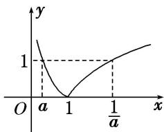

> [!faq]- 教师版例题解析
>
> > [!success]- **【答案】** (1) $(-1, 3]$；(2) D；(3) $(1, 2\sqrt{5})$；(4) C；(5) ①②③④
>
> > [!note]- **【分析】**
> > 本题未单列分析。
>
> > [!note]- **【解析】**
> > 答案 $(-1, 3]$ 解析 设 $y=\log_{4}u,\ u=g(x)=7+6x-x^{2}=-(x-3)^{2}+16$ ，则对于二次函数 $u=g(x)$ ，当 $x\leq3$ 时为增函数，当 $x\geq3$ 时为减函数。又 $y=\log_{4}u$ 是增函数，且由 $7+6x-x^{2}>0$ 得函数的定义域为 $(-1, 7)$ ，于是函数 $f(x)$ 的单调递增区间为 $(-1, 3]$ 。
> > 答案 D 解析 由于 a>0，且 $a\neq1$ ，∴u=ax-3 为增函数，∴若函数 $f(x)$ 为增函数，则 $f(x)=\log_{a}u$ 必为增函数，因此 a>1。又 u=ax-3 在 [1, 3] 上恒为正，∴a-3>0，即 a>3。
> > 答案 $(1, 2\sqrt{5})$ 解析 当 $x_{1} < x_{2} \leq \frac{a}{2}$ 时， $f(x_{2}) - f(x_{1}) < 0$ ，即函数 $f(x)$ 在区间 $\left[-\infty, \frac{a}{2}\right]$ 上为减函数，设 $g(x) = x^{2} - ax + 5$ ，则 $\left\{ \begin{array}{l} a > 1, \\ g\left(\frac{a}{2}\right) > 0, \end{array} \right.$ 解得 $1 < a < 2\sqrt{5}$ .
> > 答案 C 解析 作出 $y = |\log_a x|(0 < a < 1)$ 的大致图象如图, 令 $|\log_a x| = 1$ , 得 $x = a$ 或 $x = \frac{1}{a}$ , 又 $1 - a - \left(\frac{1}{a} - 1\right) = 1 - a - \frac{1 - a}{a} = \frac{(1 - a)(a - 1)}{a} < 0$ , 故 $1 - a < \frac{1}{a} - 1$ , 所以 $n - m$ 的最小值为 $1 - a = \frac{1}{3}$ , 即 $a = \frac{2}{3}$ .
> > 
> > 答案 ①②③④ 解析 对于①， $\because \sqrt{x^2 + 1} > \sqrt{x^2} = |x| \geq -x$ ， $\therefore \sqrt{x^2 + 1} + x > 0$ ， $\therefore f(x)$ 的定义域为 R， $\therefore$ ① 正确．对于②， $f(x) + f(-x) = \ln (x + \sqrt{x^2 + 1}) + \ln (-x + \sqrt{(-x)^2 + 1}) = \ln [(x^2 + 1) - x^2] = \ln 1 = 0$ ． $\therefore f(x)$ 是奇函数， $\therefore$ ② 正确．对于③，令 $u(x) = x + \sqrt{x^2 + 1}$ ，则 $u(x)$ 在 $[0, +\infty)$ 上单调递增．当 $x \in (-\infty, 0]$ 时， $u(x) = x + \sqrt{x^2 + 1} = \frac{1}{\sqrt{x^2 + 1} - x}$ ，而 $y = \sqrt{x^2 + 1} - x$ 在 $(- \infty, 0]$ 上单调递减，且 $\sqrt{x^2 + 1} - x > 0$ ． $\therefore u(x) = \frac{1}{\sqrt{x^2 + 1} - x}$ 在$(-\infty, 0]$ 上单调递增，又 $u(0) = 1$ ， $\therefore u(x)$ 在 $\mathbf{R}$ 上单调递增， $\therefore f(x) = \ln (x + \sqrt{x^2 + 1})$ 在 $\mathbf{R}$ 上单调递增， $\therefore③$ 正确．对于④， $\because f(x)$ 是奇函数，而 $f(a) + f(b - 1) = 0$ ， $\therefore a + (b - 1) = 0$ ， $\therefore a + b = 1$ ， $\therefore④$ 正确．对于⑤， $f(x) = g(x) - 2017$ 是奇函数，当 $x \in [-2017, 2017]$ 时， $f(x)_{\max} = M - 2017, f(x)_{\min} = m - 2017$ ， $\therefore (M - 2017) + (m - 2017) = 0$ ， $\therefore M + m = 4034$ ， $\therefore⑤$ 不正确.
