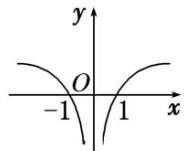

> [!faq]- 教师版对点训练解析
>
> > [!success]- **【答案】** A
>
> > [!note]- **【分析】**
> > 本题未单列分析。
>
> > [!note]- **【解析】**
> > 答案 A 解析 作出 $g(x)$ 的图象如图所示, 若使 $g(\lg x) > g(1)$ , 则 $\lg x > 1$ 或 $\lg x < -1$ , 解得 x > 10 或 $0 < x < \frac{1}{10}$ .
> > 
