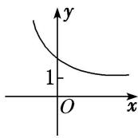
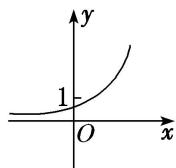
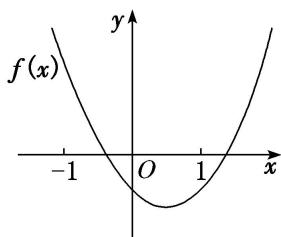
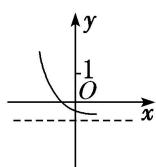
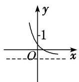
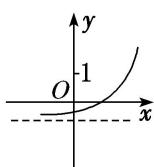
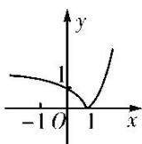
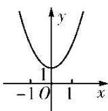

<!-- question-source:start -->
[例 1] (1) 函数 $f(x)=2^{1-x}$ 的大致图象为()

A

B

C

D

(2) 函数 $f(x)=1-e^{|x|}$ 的图象大致是()

A

B

C

D

(3) 函数 $f(x)=a^{x^{-b}}$ 的图象如图所示，其中 a, b 为常数，则下列结论正确的是()

A. $a > 1, b <   0$ B. $a > 1,b > 0$ C. $0 <   a <   1,b > 0$ D. $0 <   a <   1,b <   0$

(4) 已知函数 $f(x)=(x-a)(x-b)$ (其中 a>b) 的图象如图所示，则函数 $g(x)=a^{x}+b$ 的图象是()

A

B

C

D

(5) 已知函数 $f(x)=2^{x}-2$ ，则函数 $y=|f(x)|$ 的图象可能是()

A

B

C

D
<!-- question-source:end -->

![[高中/总复习/专题/函数/专题13 指数函数与对数函数-函数/专题十三_指数函数/考点一_指数函数的图象及应用/考向1_指数函数图象辨析/例题选讲/例题/answers/Q00030197A1.md]]
