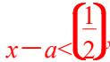

<!-- question-source:start -->
20. 若存在正数 $x$ 使 $2^{x}(x - a) < 1$ 成立, 则 $a$ 的取值范围是

<!-- question-source:end -->

![[高中/总复习/专题/函数/专题13 指数函数与对数函数-函数/专题十三_指数函数/考点二_指数函数的性质及应用/考向3_与指数函数有关的复合函数的单调性/对点训练/题目/answers/Q00030210A1.md]]
