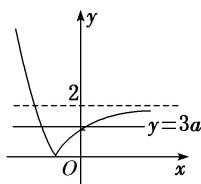

<!-- question-source:start -->
(3) 已知 $a > 0$ , 且 $a \neq 1$ , 若函数 $y = |a^x - 2|$ 与 $y = 3a$ 的图象有两个交点, 则实数 $a$ 的取值范围是 \_\_\_\_. 答案 $\left(0, \frac{2}{3}\right)$ 解析 ① 当 $0 < a < 1$ 时, 作出函数 $y = |a^x - 2|$ 的图象如图
(1). 若直线 $y = 3a$ 与函数 $y = |a^x - 2| (0 < a < 1)$ 的图象有两个交点, 则由图象可知 $0 < 3a < 2$ , 所以 $0 < a < \frac{2}{3}$ .

  
图
(1)

  
图
(2)

②当 a>1 时，作出函数 $y=|a^{x}-2|$ 的图象如图
(2)，若直线 y=3a 与函数 $y=|a^{x}-2|(a>1)$ 的图象有两个交点，则由图象可知 0<3a<2，此时无解．所以实数 a 的取值范围是 $\left(0, \frac{2}{3}\right)$ .

(4) 若存在负实数使得方程 $2^{x} - a = \frac{1}{x - 1}$ 成立，则实数 $a$ 的取值范围是（ ）A. $(2, +\infty)$ B. $(0, +\infty)$ C. $(0, 2)$ D. $(0, 1)$
<!-- question-source:end -->

![[高中/总复习/专题/函数/专题13 指数函数与对数函数-函数/考点01_指数函数的图象及应用/例题/answers/Q00056130A1.md]]
