> [!faq]- 《专题十三 指数函数(教师版)》例题解析
>
> > [!success]- **【答案】** B
>
> > [!note]- **【解析】**
> > 答案 B 解析 函数 $y_{1}=\left(\frac{1}{2}\right)x$ 与 $y_{2}=\left(\frac{1}{3}\right)x$ 的图象如图所示.
> >
> > 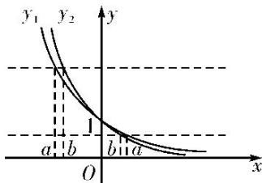
> >
> > 
> >
> > 由 $\left(\frac{1}{2}\right)^a = \left(\frac{1}{3}\right)^b$ 得 $a < b < 0$ 或 $0 < b < a$ 或 $a = b = 0$ . 故①②⑤可能成立，③④不可能成立.
> >
> > 1. 函数 $f(x)=2^{|x-1|}$ 的大致图象是()
> >
> > 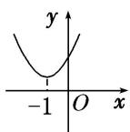
> >
> > A
> >
> > 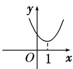
> >
> > B
> >
> > 
> >
> > C
> >
> > 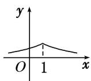
> >
> > D
> >
> > 1. 答案 B 解析 $f(x)=\left\{\begin{aligned}&2^{x-1},&x\geq1,\\ &\left(\frac{1}{2}\right)^{x-1},&x<1,\end{aligned}\right.$ 易知 $f(x)$ 在 $[1,+\infty)$ 上单调递增，在 $(-∞,1)$ 上单调递减，故选 B.
> >
> > 2. 已知函数 $y = kx + a$ 的图象如图所示，则函数 $y = a^{x + k}$ 的图象可能是（）
> >
> > 
> >
> > 
> >
> > A
> >
> > 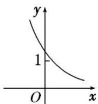
> >
> > B
> >
> > 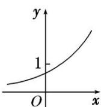
> >
> > 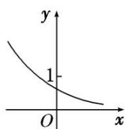
> >
> > C
> >
> > D
> >
> > 2. 答案 B 解析 由函数 $y = kx + a$ 的图象可得 $k < 0, 0 < a < 1$ ，又因为与 $x$ 轴交点的横坐标大于 1，所以 $-1 < k < 0$ . 函数 $y = a^{x + k}$ 的图象可以看成把 $y = a^x$ 的图象向右平移 $-k$ 个单位得到的，且函数 $y = a^{x + k}$ 是减函数，故此函数与 $y$ 轴交点的纵坐标大于 1，结合所给的选项，应该选 B.
> >
> > 3. 函数 $y = a^{x} - a^{-1} (a > 0$ ，且 $a \neq 1$ 的图象可能是（）
> >
> > 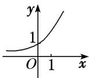
> >
> > A
> >
> > 
> >
> > B
> >
> > 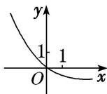
> >
> > 
> >
> > C
> >
> > D
> >
> > 3. 答案 D 解析 函数 $y = a^{x} - \frac{1}{a}$ 是由函数 $y = a^{x}$ 的图象向下平移 $\frac{1}{a}$ 个单位长度得到的，A项显然错误；当 $a > 1$ 时， $0 < \frac{1}{a} < 1$ ，平移距离小于1，所以B项错误；当 $0 < a < 1$ 时， $\frac{1}{a} > 1$ ，平移距离大于1，所以C项错误。故选D.
> >
> > 4. 已知 $0 < m < n < 1$ ，则指数函数① $y = m^x$ ，② $y = n^x$ 的图象为（）
> >
> > 
> >
> > A
> >
> > 
> >
> > B
> >
> > 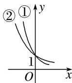
> >
> > C
> >
> > 
> >
> > D
> >
> > 4. 答案 C 解析 由于 $0 < m < n < 1$ ，所以 $y = m^x$ 与 $y = n^x$ 都是减函数，故排除 A，B，作直线 $x = 1$ 与两个曲线相交，交点在下面的是函数 $y = m^x$ 的图象.
> >
> > 5. 定义一种运算: $a \otimes b = \begin{cases} a, & a \geq b, \\ b, & a < b, \end{cases}$ 已知函数 $f(x) = 2^x \otimes (3 - x)$ , 那么函数 $y = f(x + 1)$ 的大致图象是( )
> >
> > 
> >
> > Λ
> >
> > 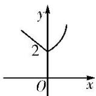
> >
> > B
> >
> > 
> >
> > C
> >
> > 
> >
> > D
> >
> > 5. 答案 B 解析 由题意可得 $f(x) = 2^x \quad (3 - x) = \begin{cases} 2^x, & x \geq 1, \\ 3 - x, & x < 1, \end{cases}$ 所以 $f(x + 1) = \begin{cases} 2^{x + 1}, & x \geq 0, \\ 2 - x, & x < 0, \end{cases}$ 则大致图象为B项.
> >
> > 6. 已知函数 $f(x) = 4 + 2a^{x - 1}$ 的图象恒过定点 $P$ ，则点 $P$ 的坐标是( )
> >
> > A. (1, 6) B. (1, 5) C. (0, 5) D. (5, 0)
> >
> > 6. 答案 A 解析 由于函数 $y = a^x$ 的图象过定点(0, 1)，当 $x = 1$ 时， $f(x) = 4 + 2 = 6$ ，故函数 $f(x) = 4 + 2a^x - 1$ 的图象恒过定点 $P(1, 6)$ .
> >
> > 7. 若函数 $y = |2^x - 1|$ 的图象与直线 $y = b$ 有两个公共点，则 $b$ 的取值范围为 \_\_\_\_.
> >
> > 7. 答案 (0, 1) 解析 作出曲线 $y = |2^x - 1|$ 的图象与直线 $y = b$ 如图所示。由图象可得 $b$ 的取值范围是(0, 1).
> >
> > 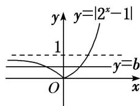
> >
> > 8. 已知 $f(x) = |2^x - 1|$ ，当 $a < b < c$ 时，有 $f(a) > f(c) > f(b)$ ，则必有（）
> > A. $a < 0, b < 0, c < 0$ B. $a < 0, b > 0, c > 0$ C. $2^{-a} < 2^c$ D. $1 < 2^a + 2^c < 2$
> >
> > 8. 答案 D 解析 作出函数 $f(x) = |2^x - 1|$ 的图象如图所示，因为 $a < b < c$ ，且有 $f(a) > f(c) > f(b)$ ，所以必有 $a < 0$ ， $0 < c < 1$ ，且 $|2^a - 1| > |2^c - 1|$ ，所以 $1 - 2^a > 2^c - 1$ ，则 $2^a + 2^c < 2$ ，且 $2^a + 2^c > 1$ 。故选 D.
> >
> > 
> >
> > 9. 若曲线 $|y|=2^{x}+1$ 与直线 $y=b$ 没有公共点，则 $b$ 的取值范围是 \_\_\_\_.
> >
> > 9. 答案 $[-1, 1]$ 解析 曲线 $|y| = 2^x + 1$ 与直线 $y = b$ 的图象如图所示，由图可知：如果 $|y| = 2^x + 1$ 与直线 $y = b$ 没有公共点，则 $b$ 应满足的条件是 $b \in [-1, 1]$ .
> >
> > 
> >
> > 10. 如图, 在面积为 8 的平行四边形 $OABC$ 中, $AC \perp CO$ , $AC$ 与 $BO$ 交于点 $E$ . 若指数函数 $y = a^{x} (a > 0$ , 且 $a \neq 1)$ 经过点 $E$ , $B$ , 则 $a$ 的值为( )
> >
> > 
> >
> > A. $\sqrt{2}$ B. $\sqrt{3}$ C. 2 D. 3
> >
> > 10. 答案 A 解析 设点 $E(t, a^t)$ ，则点 $B$ 的坐标为 $(2t, 2a^t)$ 。因为 $2a^t = a^{2t}$ ，所以 $a^t = 2$ 。因为平行四边形 $OABC$ 的面积 $= OC \times AC = a^t \times 2t = 4t$ ，又平行四边形 $OABC$ 的面积为 8，所以 $4t = 8$ ， $t = 2$ ，所以 $a^2 = 2$ ， $a = \sqrt{2}$ 。
> >
> > 故选 **A**.
