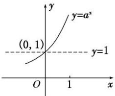
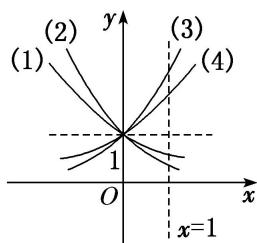

## 考点一 指数函数的图象及应用

## 【基本知识】

1. 指数函数的定义

函数 $y=a^{x}(a>0$ ，且 $a\neq1)$ 叫做指数函数，其中指数 x 是自变量，函数的定义域是 R，a 是底数.

## 2. 指数函数的图象

<table><tr><td rowspan="2">函数</td><td colspan="2"> $y = a^{x}(a > 0$ ,且  $a \neq 1)$ </td></tr><tr><td> $0 < a < 1$ </td><td> $a > 1$ </td></tr><tr><td>图象</td><td></td><td></td></tr><tr><td rowspan="2">图象特征</td><td colspan="2">在  $x$  轴上方,过定点(0,1)</td></tr><tr><td>当  $x$  逐渐增大时,图象逐渐下降</td><td>当  $x$  逐渐增大时,图象逐渐上升</td></tr></table>

## 【常用结论】

## 1. 指数函数图象的画法

画指数函数 $y = a^{x} (a > 0$ ，且 $a \neq 1$ 的图象，应抓住三个关键点： $(1, a), (0, 1)$ ， $\left(-1, \frac{1}{a}\right)$ 和一条渐近线 $y = 0$ .

2. 底数 $a$ 与 1 的大小关系决定了指数函数图象的“升降”: 当 $a > 1$ 时, 指数函数的图象“上升”; 当 $0 < a < 1$ 时, 指数函数的图象“下降”.

3. 函数 $y = a^{x}$ 与 $y = \left(\frac{1}{a}\right)^{x} (a > 0$ ，且 $a \neq 1$ 的图象关于 $y$ 轴对称.

4. 指数函数的图象与底数大小的比较

如图是指数函数
(1) $y=a^{x}$ ，
(2) $y=b^{x}$ ，
(3) $y=c^{x}$ ，
(4) $y=d^{x}$ 的图象，底数a，b，c，d与1之间的大小关系为c>d>1>a>b>0。由此我们可得到以下规律：在第一象限内，指数函数 $y=a^{x}(a>0,a\neq1)$ 的图象越高，底数越大。简称“底大图高”。

## 考向1 指数函数图象辨析

【方法总结】

## 有关指数函数图象辨析及图象应用的解题思路

(1)已知函数解析式判断其图象, 一般是取特殊点, 判断选项中的图象是否过这些点, 若不满足则排除.

(2)对于有关指数型函数的图象问题，一般是从最基本的指数函数的图象入手，通过平移、伸缩、对称

变换而得到．特别地，当底数 a 与 1 的大小关系不确定时应注意分类讨论.

(3)根据指数函数图象判断底数大小的问题, 可以通过底大图高进行判断.

【例题选讲】

[例 1]
![[高中/总复习/专题/函数/专题13 指数函数与对数函数-函数/考点01_指数函数的图象及应用/例题/Q00056123.md]]
![[高中/总复习/专题/函数/专题13 指数函数与对数函数-函数/考点01_指数函数的图象及应用/例题/Q00056124.md]]
![[高中/总复习/专题/函数/专题13 指数函数与对数函数-函数/考点01_指数函数的图象及应用/例题/Q00056125.md]]
![[高中/总复习/专题/函数/专题13 指数函数与对数函数-函数/考点01_指数函数的图象及应用/例题/Q00056126.md]]
![[高中/总复习/专题/函数/专题13 指数函数与对数函数-函数/考点01_指数函数的图象及应用/例题/Q00056127.md]]
![[高中/总复习/专题/函数/专题13 指数函数与对数函数-函数/考点01_指数函数的图象及应用/例题/Q00056128.md]]
![[高中/总复习/专题/函数/专题13 指数函数与对数函数-函数/考点01_指数函数的图象及应用/例题/Q00056129.md]]
![[高中/总复习/专题/函数/专题13 指数函数与对数函数-函数/考点01_指数函数的图象及应用/例题/Q00056130.md]]
![[高中/总复习/专题/函数/专题13 指数函数与对数函数-函数/考点01_指数函数的图象及应用/例题/Q00056131.md]]
