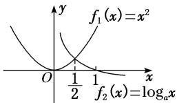

> [!faq]- 《专题十三 对数函数(教师版)》例题解析
>
> > [!success]- **【答案】** 详见解析
>
> > [!note]- **【解析】**
> > 答案 $\left[\frac{1}{16}, 1\right]$ 解析 设 $f_{1}(x) = x^{2}$ , $f_{2}(x) = \log_{a}x$ , 要使 $x \in \left(0, \frac{1}{2}\right)$ 时, 不等式 $x^{2} < \log_{a}x$ 恒成立, 只需 $f_{1}(x) = x^{2}$ 在 $\left(0, \frac{1}{2}\right)$ 上的图象在 $f_{2}(x) = \log_{a}x$ 图象的下方即可. 当 $a > 1$ 时, 显然不成立; 当 $0 < a < 1$ 时, 如图所示, 要使 $x^{2} < \log_{a}x$ 在 $x \in \left(0, \frac{1}{2}\right)$ 上恒成立, 需 $f_{1}\left(\frac{1}{2}\right) \leq f_{2}\left(\frac{1}{2}\right)$ ,
> >
> > 
> >
> > 所以有 $\left(\frac{1}{2}\right)^{2}\leq\log_{a}\frac{1}{2}$ ，解得 $a\geq\frac{1}{16}$ ，所以 $\frac{1}{16}\leq a<1$ ．即实数a的取值范围是 $\left[\frac{1}{16},1\right]$ .
