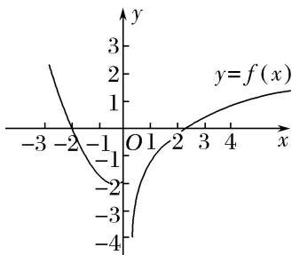
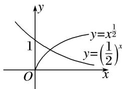
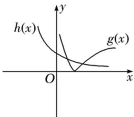
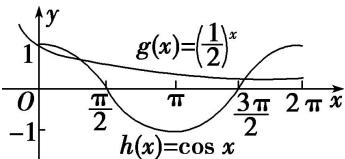
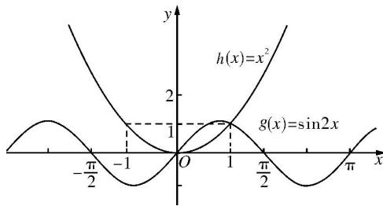

> [!faq]- 教师版例题解析
>
> > [!success]- **【答案】** (1) 3；(2) B；(3) C；(4) 2；(5) B；(6) B；(7) 3；(8) 2
>
> > [!note]- **【分析】**
> > 本题未单列分析。
>
> > [!note]- **【解析】**
> > 答案 3 解析 由题意知， $\cos\left(3x+\frac{\pi}{6}\right)=0$ ，所以 $3x+\frac{\pi}{6}=\frac{\pi}{2}+k\pi,\quad k\in\mathbf{Z}$ ，所以 $x=\frac{\pi}{9}+\frac{k\pi}{3},\quad k\in\mathbf{Z}$ ，当 k=0 时， $x=\frac{\pi}{9}$ ；当 k=1 时， $x=\frac{4\pi}{9}$ ；当 k=2 时， $x=\frac{7\pi}{9}$ ，均满足题意，所以函数 $f(x)$ 在 $[0,\pi]$ 的零点个数为 3.
> > 答案 B 解析 法一 由 $f(x) = 0$ 得 $\begin{cases} x \leq 0, \\ x^2 + x - 2 = 0 \end{cases}$ 或 $\begin{cases} x > 0, \\ -1 + \ln x = 0, \end{cases}$ 解得 $x = -2$ 或 $x = e$ . 因此函数 $f(x)$ 共有 2 个零点.
> > 法二 函数 $f(x)$ 的图象如图所示，由图象知函数 $f(x)$ 共有 2 个零点.
> > 
> > 答案 C 解析 $g(x)=f(1-x)-1=\left\{\begin{aligned}(1-x)^{2}+2(1-x)-1, & 1-x\leq0,\\ \lg(1-x)|-1, & 1-x>0\end{aligned}\right.$ $=\left\{\begin{aligned}x^{2}-4x+2, & x\geq1,\\ \lg(1-x)|-1, & x<1,\end{aligned}\right.$ 易
> > 知当 $x \geq 1$ 时，函数 $g(x)$ 有 1 个零点；当 $x < 1$ 时，函数 $g(x)$ 有 2 个零点，所以函数 $g(x)$ 的零点共有 3 个，故选 C.
> > 答案 2 解析 当 $x \leq 0$ 时，令 $x^2 - 2 = 0$ ，解得 $x = -\sqrt{2}$ (正根舍去)，所以在 $(- \infty, 0]$ 上， $f(x)$ 有一个零点；当 $x > 0$ 时， $f'(x) = 2 + \frac{1}{x} > 0$ 恒成立，所以 $f(x)$ 在 $(0, +\infty)$ 上是增函数。又因为 $f(2) = -2 + \ln 2 < 0$ ， $f(3) = \ln 3 > 0$ ，所以 $f(x)$ 在 $(0, +\infty)$ 上有一个零点，综上，函数 $f(x)$ 的零点个数为 2。
> > 答案 B 解析 函数 $f(x) = x^{\frac{1}{2}} - (\frac{1}{2})^x$ 的零点个数是方程 $x^{\frac{1}{2}} - (\frac{1}{2})^x = 0$ 的解的个数，即方程 $x^{\frac{1}{2}} = (\frac{1}{2})^x$ 的解的个数，也就是函数 $y = x^{\frac{1}{2}}$ 与 $y = (\frac{1}{2})^x$ 的图象的交点个数，在同一坐标系中作出两个函数的图象如图所示，可得交点个数为 1.
> > 
> > 答案 B 解析 函数 $f(x) = 3^{x} |\ln x| - 1$ 的零点数的个数即函数 $g(x) = |\ln x|$ 与函数 $h(x) = (\frac{1}{3})^{x}$ 图象的交点个数．作出函数 $g(x) = |\ln x|$ 和函数 $h(x) = (\frac{1}{3})^{x}$ 的图象，由图象可知，两函数图象有两个交点，故函数 $f(x) = 3^{x} |\ln x| - 1$ 有2个零点.
> > 
> > 答案 3 解析 如图，作出 $g(x) = \left(\frac{1}{2}\right)^x$ 与 $h(x) = \cos x$ 的图象，可知其在 $[0, 2\pi]$ 上的交点个数为 3，所以函数 $f(x)$ 在 $[0, 2\pi]$ 上的零点个数为 3.
> > 
> > 答案 2 解析 函数 $f(x)=2\sin x\sin\left(x+\frac{\pi}{2}\right)-x^{2}$ 的零点个数等价于方程 $2\sin x\sin\left(x+\frac{\pi}{2}\right)-x^{2}=0$ 的根的个数，即函数 $g(x)=2\sin x\sin\left(x+\frac{\pi}{2}\right)=2\sin x\cos x=\sin 2x$ 与 $h(x)=x^{2}$ 的图象交点个数。分别画出两函数图象，如图，由图可知，函数 $g(x)$ 与 $h(x)$ 的图象有 2 个交点。故零点个数为 2。
> > 
