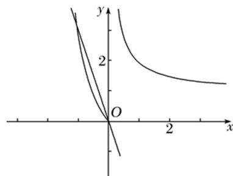

> [!faq]- 教师版对点训练解析
>
> > [!success]- **【答案】** C
>
> > [!note]- **【分析】**
> > 本题未单列分析。
>
> > [!note]- **【解析】**
> > 答案 C 解析 解法 1 令 $f(x) + 3x = 0$ ，则 $\begin{cases} x \leq 0, \\ x^2 - 2x + 3x = 0 \end{cases}$ 或 $\begin{cases} x > 0, \\ 1 + \frac{1}{x} + 3x = 0, \end{cases}$ 解得 $x = 0$ 或 $x = -1$ ，所以函数 $y = f(x) + 3x$ 的零点个数是 2．故选 C.
> > 解法 2 函数 $y = f(x) + 3x$ 的零点个数就是 $y = f(x)$ 与 $y = -3x$ 两个函数图象的交点个数，如图所示，由函数的图象可知，零点个数为 2.
> > 
