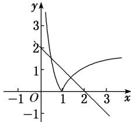

> [!faq]- 教师版对点训练解析
>
> > [!success]- **【答案】** B
>
> > [!note]- **【分析】**
> > 本题未单列分析。
>
> > [!note]- **【解析】**
> > 答案 B 解析 函数 $f(x) = |\log_2 x| + x - 2$ 的零点个数，就是方程 $|\log_2 x| + x - 2 = 0$ 的根的个数。令 $h(x) = |\log_2 x|$ ， $g(x) = 2 - x$ ，在同一坐标平面上画出两函数的图象，如图所示。由图象得 $h(x)$ 与 $g(x)$ 有 2 个交点，∴ 方程 $|\log_2 x| + x - 2 = 0$ 的根的个数为 2。
> > 
