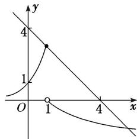

> [!faq]- 教师版对点训练解析
>
> > [!success]- **【答案】** B
>
> > [!note]- **【分析】**
> > 本题未单列分析。
>
> > [!note]- **【解析】**
> > 答案 B 解析 函数 $y=f(x)+x-4$ 的零点个数，即函数 $y=-x+4$ 与 $y=f(x)$ 的图象的交点的个数。如图所示，函数 $y=-x+4$ 与 $y=f(x)$ 的图象有两个交点，故函数 $y=f(x)+x-4$ 的零点有 2 个。故选 B.
> > 
