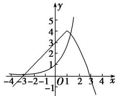

> [!faq]- 教师版对点训练解析
>
> > [!success]- **【答案】** 详见解析
>
> > [!note]- **【分析】**
> > 本题未单列分析。
>
> > [!note]- **【解析】**
> > 答案 2 解析 函数 $g(x) = f(x) - \mathrm{e}^x$ 的零点个数即为函数 $y = f(x)$ 与 $y = \mathrm{e}^x$ 的图象的交点个数。作出函数图象可知有 2 个交点，即函数 $g(x) = f(x) - \mathrm{e}^x$ 有 2 个零点。
> > 
