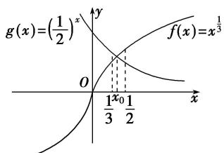

> [!faq]- 《专题14 函数的零点问题(1)-函数》例题解析
>
> > [!success]- **【答案】** C
>
> > [!note]- **【分析】**
> > 本题未单列分析。
>
> > [!note]- **【解析】**
> > 答案 C 解析 令 $g(x) = \left(\frac{1}{2}\right)^x$ , $f(x) = x^{\frac{1}{3}}$ ，则 $g(0) = 1 > f(0) = 0$ ， $g\left(\frac{1}{2}\right) = \left(\frac{1}{2}\right)^{\frac{1}{2}} < f\left(\frac{1}{2}\right) = \left(\frac{1}{2}\right)^{\frac{1}{3}}$ ， $g\left(\frac{1}{3}\right) = \left(\frac{1}{2}\right)^{\frac{1}{3}} > f\left(\frac{1}{3}\right) = \left(\frac{1}{3}\right)^{\frac{1}{3}}$ ，所以由图象关系可得 $\frac{1}{3} < x_0 < \frac{1}{2}$ .
> > 
