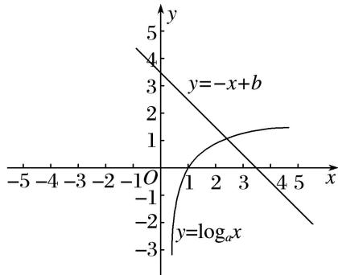

> [!faq]- 《专题14 函数的零点问题(1)-函数》例题解析
>
> > [!success]- **【答案】** 详见解析
>
> > [!note]- **【分析】**
> > 本题未单列分析。
>
> > [!note]- **【解析】**
> > 答案 2 解析 对于函数 $y = \log_a x$ ，当 $x = 2$ 时，可得 $y < 1$ ，当 $x = 3$ 时，可得 $y > 1$ ，在同一坐标系中画出函数 $y = \log_a x$ ， $y = -x + b$ 的图象，判断两个函数图象的交点的横坐标在(2, 3)内，∴函数 $f(x)$ 的零点 $x_0 \in (n, n + 1)$ 时， $n = 2$ .
> >
> > 
