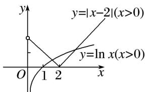

> [!faq]- 《专题14 函数的零点问题(1)-函数》例题解析
>
> > [!success]- **【答案】** C
>
> > [!note]- **【解析】**
> > 答案 C 解析 由题意可知 $f(x)$ 的定义域为 $(0, +\infty)$ ，在同一直角坐标系中画出函数 $y = |x - 2| (x > 0)$ ， $y = \ln x (x > 0)$ 的图象，如图所示。由图可知函数 $f(x)$ 在定义域内的零点个数为 2。
> >
> > 
