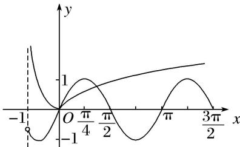

> [!faq]- 《专题14 函数的零点问题(1)-函数》例题解析
>
> > [!success]- **【答案】** 详见解析
>
> > [!note]- **【解析】**
> > 答案 2 解析 $f(x) = 2(1 + \cos x)\sin x - 2\sin x - |\ln (x + 1)| = \sin 2x - |\ln (x + 1)|$ ， $x > -1$ ，函数 $f(x)$ 的零点个数即为函数 $y_{1} = \sin 2x(x > -1)$ 与 $y_{2} = |\ln (x + 1)|(x > -1)$ 的图象的交点个数。分别作出两个函数的图象，如图，可知有两个交点，则 $f(x)$ 有两个零点。
> >
> > 
