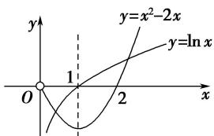

> [!faq]- 《专题14 函数的零点问题(1)-函数》例题解析
>
> > [!success]- **【答案】** 详见解析
>
> > [!note]- **【分析】**
> > 本题未单列分析。
>
> > [!note]- **【解析】**
> > 答案 3 解析 当 $x > 0$ 时，作函数 $y = \ln x$ 和 $y = x^2 - 2x$ 的图象，由图知，当 $x > 0$ 时， $f(x)$ 有2个零点；当 $x \leq 0$ 时，令 $x^2 - 2 = 0$ ，解得 $x = -\sqrt{2}$ （正根舍去），所以在 $(- \infty, 0]$ 上有一个零点，综上知 $f(x)$ 有3个零点.
> > 
