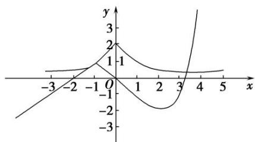

> [!faq]- 《专题14 函数的零点问题(1)-函数》例题解析
>
> > [!success]- **【答案】** B
>
> > [!note]- **【解析】**
> > 答案 B 解析 画出函数 $f(x) = \begin{cases} 1 - |x + 1|, & x < 1, \\ x^2 - 4x + 2, & x \geq 1, \end{cases}$ 的图象如图，由 $g(x) = 2^{|x|}f(x) - 2 = 0$ 可得
> >
> > 
> >
> > $f(x) = \frac{2}{2^{|x|}}$ ，则问题化为函数 $f(x) = \left\{ \begin{array}{ll}1 - |x + 1|, & x <   1,\\ x^{2} - 4x + 2, & x\geq 1, \end{array} \right.$ 与函数 $y = \frac{2}{2^{|x|}} = 2^{1 - |x|}$ 的图象的交点的个数问题.结合图象可以看出两函数图象的交点只有两个，应选答案B.
