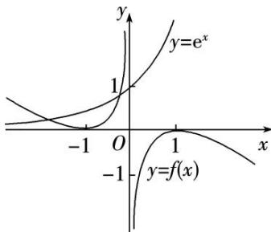
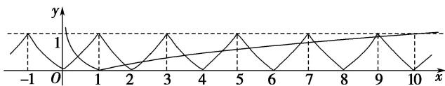
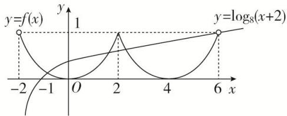
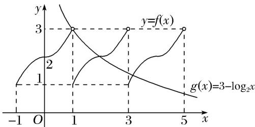
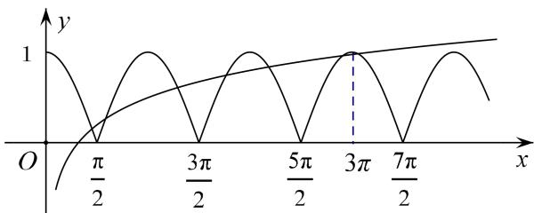

> [!faq]- 教师版例题解析
>
> > [!success]- **【答案】** (1) C；(2) B；(3) C；(4) B；(5) D
>
> > [!note]- **【分析】**
> > 本题未单列分析。
>
> > [!note]- **【解析】**
> > 答案 C 解析 当 x>0 时， $f(x)=\ln x-x+1$ ， $f'(x)=\frac{1}{x}-1=\frac{1-x}{x}$ ，所以 $x\in(0,1)$ 时 $f'(x)>0$ ，此时 $f(x)$ 单调递增； $x\in(1,+\infty)$ 时， $f'(x)<0$ ，此时 $f(x)$ 单调递减。因此，当 x>0 时， $f(x)_{\max}=f(1)=\ln 1-1+1=0$ 。根据函数 $f(x)$ 是定义在 R 上的奇函数作出函数 $y=f(x)$ 与 $y=e^{x}$ 的大致图象如图所示，观察到函数 $y=f(x)$ 与 $y=e^{x}$ 的图象有两个交点，所以函数 $g(x)=f(x)-e^{x}$ （e 为自然对数的底数）有 2 个零点。
> > 
> > 答案 B 解析 在坐标平面内画出 $y=f(x)$ 与 $y=|\lg x|$ 的大致图象如图，由图象可知，它们共有 10 个不同的交点，因此函数 $F(x)=f(x)-|\lg x|$ 的零点个数是 10.
> > 
> > 答案 C 解析 原方程等价于 $y=f(x)$ 与 $y=\log_{8}(x+2)$ 的图象的交点个数问题，由 $f(x+2)=f(2-x)$ ，可知 $f(x)$ 的图象关于 x=2 对称，再根据 $f(x)$ 是偶函数这一性质，可由 $f(x)$ 在 $[-2,0]$ 上的解析式，作出 $f(x)$ 在 $(0,2)$ 上的图象，进而作出 $f(x)$ 在 $(-2,6)$ 上的图象，如图所示.
> > 
> > 再在同一坐标系下，画出 $y = \log_8(x + 2)$ 的图象，注意其图象过点(6, 1)，由图可知，两图象在区间(-2, 6)内有三个交点，从而原方程有三个根，故选C.
> > 答案 B 解析 由 $f(x + 1) = f(x - 1)$ ，即 $f(x + 2) = f(x)$ ，知 $y = f(x)$ 的周期 $T = 2$ 。在同一坐标系中作出 $y = f(x)$ 与 $y = g(x)$ 的图象(如图)。由于两函数图象有 2 个交点，所以函数 $F(x) = f(x) - g(x)$ 在 $(0, +\infty)$ 内有 2 个零点。
> > 
> > 答案 D 解析 与 $y = -\lg (-x)$ 的图象关于原点对称的函数是 $y = \lg x$ ，函数 $f(x)$ 的图象上的优美点的对数，即方程 $|\cos x| = \lg x (x > 0)$ 的解的个数，也是函数 $y = |\cos x|$ 与 $y = \lg x$ 的图象的交点个数，如图，作函数 $y = |\cos x|$ 与 $y = \lg x$ 的图象，由图可知，共有7个交点，函数 $f(x)$ 的图象上存在“优美点”共有7对．故选D.
> > 
