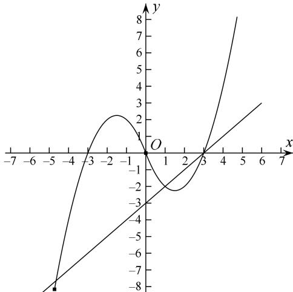

> [!faq]- 教师版对点训练解析
>
> > [!success]- **【答案】** D
>
> > [!note]- **【分析】**
> > 本题未单列分析。
>
> > [!note]- **【解析】**
> > 答案 D 解析 求出当 $x < 0$ 时 $f(x)$ 的解析式，分类讨论解方程即可．令 $x < 0$ ，则 $-x > 0$ ，所以 $f(-x) = (-x)^2 + 3x = x^2 + 3x$ ．因为 $f(x)$ 是定义在 $\mathbf{R}$ 上的奇函数，所以 $f(-x) = -f(x)$ ．所以当 $x < 0$ 时， $f(x)$
> > $= -x^{2} - 3x$ 。所以当 $x \geq 0$ 时， $g(x) = x^{2} - 4x + 3$ 。令 $g(x) = 0$ ，即 $x^{2} - 4x + 3 = 0$ ，解得 $x = 1$ 或 $x = 3$ 。当 $x < 0$ 时， $g(x) = -x^{2} - 4x + 3$ 。令 $g(x) = 0$ ，即 $x^{2} + 4x - 3 = 0$ ，解得 $x = -2 + \sqrt{7} > 0$ （舍去）或 $x = -2 - \sqrt{7}$ 。所以函数 $g(x)$ 有三个零点，故其集合为 $\{-2 - \sqrt{7}, 1, 3\}$ 。
> > 
